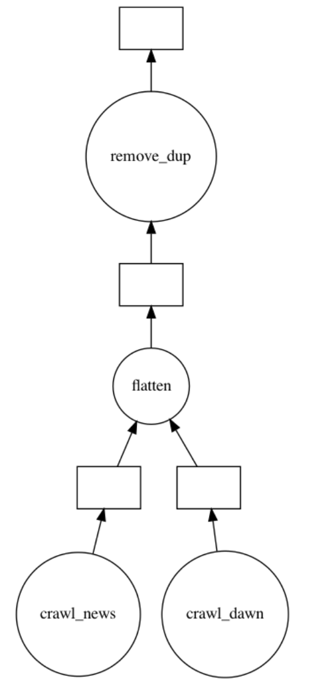
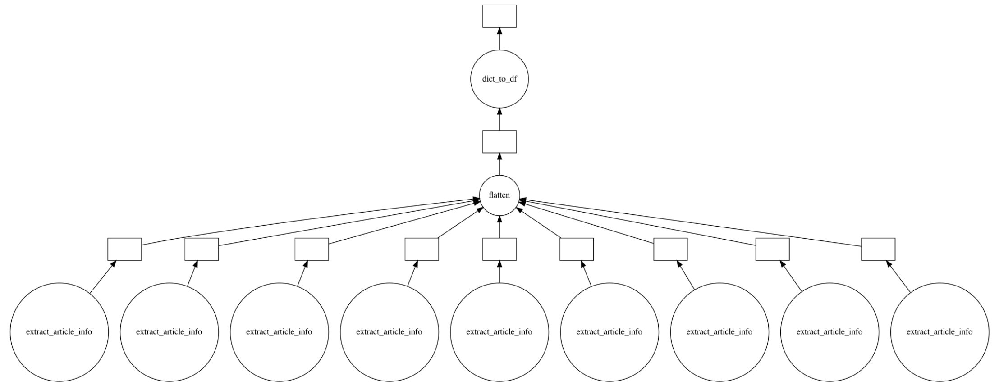
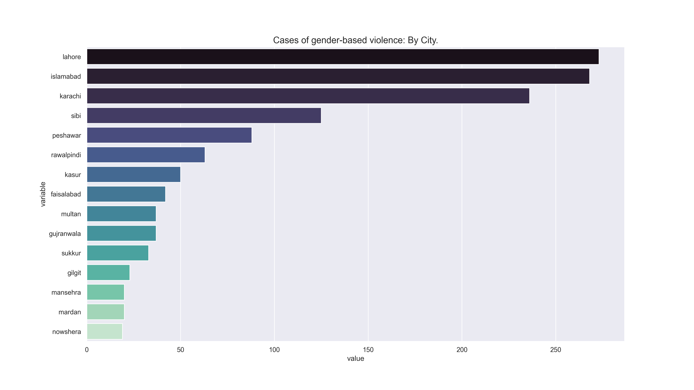
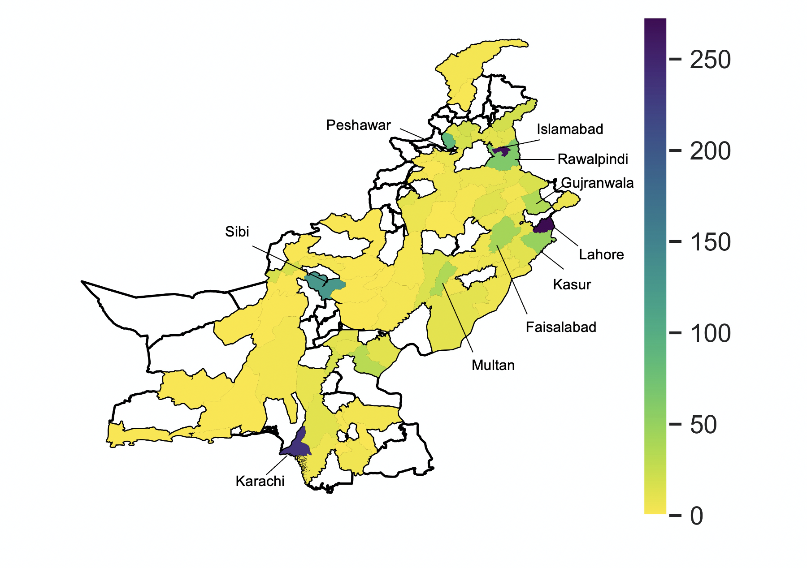
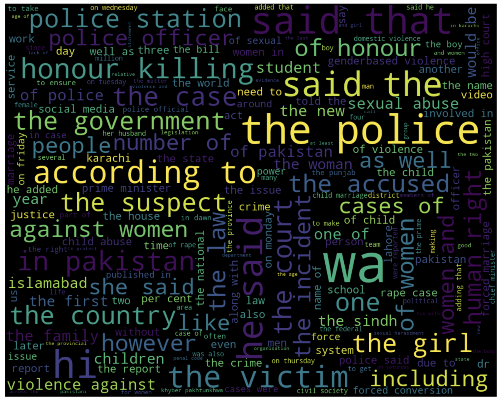

# Mapping gender-based violence in Pakistan

## Trigger Warning:

This document and project as a whole contain references to sexual abuse, harrassment and violence.

### Note on README length:
The actual README is < 1250 words long if we exclude the Trigger Warning, Acknowledgements, Project Repository and this note.

Acknowledgements:

- Jon Clindaniel, Professor
- Luxin Tian, Teaching Assistant
- Shmyla Khan, Director, Digital Rights Foundation
- Yutao Chen, Teaching Assistant

Project Repository:

- [project.ipynb](project.ipynb): Jupyter Notebook containing all-project code (excluding crawling, extracting and helper functions)
- [scraping_functions.py](scraping_functions.py): Helper functions I created for crawling purposes
- [get_information.py](get_information.py): Helper functions I created for extracting information
- [misc_helper_functions.py](misc_helper_functions.py): Miscellaneous helper functions
- [dask1.png](dask1.png): Task Graph
- [dask2.png](dask2.png): Task Graph
- [map.jpeg](map.png): Mapping instances of GBV across Pakistan
- [map_labelled.jpeg](map_labelled.png): Map with labels
- [map_labelled_manually.png](map_labelled_manually.png): Map with manually added labels
- [wordcloud.png](wordcloud.png): Wordcloud
- [dask_wordcloud.png](dask_wordcloud.png): Task Graph
- [lda.html](lda.html): Topic Modeling HTML
- [pk.csv](pk.csv): CSV containing names of Pakistani cities
- [drf_data.xlsx](drf_data.xlsx): Data provided by the Digital Rights Foundation

# Context

Although Gender-Based Violence (GBV) can take up many forms, we start off with a rather straightforward definition: **Acts directed at individuals based on their gender** -- such acts can take on many forms (discussed later on). In Pakistan, these acts are prevalent. However, statistics do not represent the actual number of incidents. The numbers are underestimated as many such cases go unreported or unnoticed.

Even though Social Media has played a massive role in amplifying unheard voices, allowing individuals to report and speak against such incidents, we aim to learn about GBV and related incidents from pre-existing forms of media (newspapers). Organizations such as the [Digital Rights Foundation](https://digitalrightsfoundation.pk/) are currently working on collecting information on GBV-related incidents -- their existing data contains links and keywords for such incidents from September 2020 onwards. This project aims to build on this by: 

1. Gather additional information on GBV-related incidents in Pakistan from Newspapers
2. Perform exploratory and additional analysis on collected information
3. Unsupervised Machine Learning (Topic Modelling)

For the purpose of this project, we utilize Parallel and Large-Scale Computing tools (primarily Dask). The data from this project will be made publicly available.

# Methdology

## Gathering Information:

A basic overview of the methodology for gathering information is as follow:

- Choose Newspapers to collect information from
- Identify keywords to search on each Newspaper
- Go to each Newspaper's website and search each keyword
- Search (usually) goes back 10 pages so we collect information **for each keyword from each page**
- Collect all links for each keyword
- Go to each link, extract features. These include: date-time, title, text, images, authors, keywords etc.

For this project, we look at the following newspapers:

1. [Dawn](https://www.dawn.com/)
2. [The News](https://www.thenews.com.pk/)

These are the two leading English newspapers in Pakistan. We currently only consider English newspapers with an online presence. Potentially, we would like to include OCR tools to consider newspapers published in Urdu as well.

Next, we identify 15 keywords based on looking at frequencies of keywords in the data provided by the Digital Rights Foundation and basic qualitative research. These keywords are as follows:

```
keywords = ["rape", "gang-rape", "gender-based violence", "honor killing", 
            "honor killing", "harassment", "blackmail”, “child abuse", 
            "forced marriage", "forced abortion", "women killed over honor", 
            "girl", "boy", "allegedly", "police"]
```

In order to go about collecting information from webpages for the aforementioned newspapers, we require a web-crawler. Thus, we create two (one for each newspaper):

1. crawl_dawn
2. crawl_news

These take in a keyword as an input and searches each keyword on the respective newspaper. It collects links from each of the pages that result from the search. Once the crawler has collected information from one page, we create a csv that is updated for every page -- this allows us to store the data in case there is any error while our crawler is running. In other words, it **allows us to handle errors** -- for memory purposes, we have not uplodaded these CSVs on the GitHub repository.

## Implementation of Crawlers (Dask)

The created web-crawlers are implemented using Dask for each keyword. We utilize Dask on a local computer for the purpose of this project. This can be readily scaled up on AWS or on RCC. Since, for now, the scale of the project is relatively smaller, utilizing Dask on a local computer is justified. Alternatively, we can use PyWren through AWS as well. However, this is an expensive implementation.

Dask is implemented in the following way:

1. Create a cluster
2. Scale it up to 4 workers
3. Check cluster status
4. Define keywords
5. Call **crawlers as delayed functions** to search each keyword on both newspapers
6. Call **a delayed function that flattens** the results returned by 5.
7. Call **a delayed remove duplicates function** that removes duplicates

The code is as follows:

```
from dask.delayed import delayed
import dask
results = []

for word in keywords:
    dawn = dask.delayed(crawl_dawn)(word)
    news = dask.delayed(crawl_news)(word)
    results.append(dawn)
    results.append(news)

flatten_delayed = dask.delayed(flatten)(results)
unique_delayed = dask.delayed(remove_dup)(flatten_delayed)
unique_delayed.visualize()
```

I create a task graph for **one keyword** (task graph for 15 keywords is in [the project jupyter-notebook](project.ipynb)). This is as follows:



This allows us to gather relevant links in parallel. We are returned a link containing links that were scraped -- we did not face any errors will running our implementation. However, as backup, we saved csvs.

Once we have gathered all the links, our next step is to extract information from these. For this, we utilize the [Newspaper](https://newspaper.readthedocs.io/en/latest/) -- this allows us to extract all relevant features (title, text, date-time, images and more) from an article link. We face errors in doing so at times but are able to collect information for ~1200 newspaper articles.

Dask is utilized for this purpose. We extract each link's information using a delayed function that returns a list of dictionaries (each containing features for an article). We then flatten the list of dictionaries and convert it to a dataframe.

```
from dask.delayed import delayed
import dask
results = []

for link in combined_result_short:
    #extract_article_info function returns a dictionary with extracted
    #features for a given link (article)
    info = dask.delayed(extract_article_info)(link)
    results.append(info)

flatten_delayed = dask.delayed(flatten)(results)
delayed = dask.delayed(dict_to_df)(flatten_delayed)

delayed.visualize("dask2")
```

A Dask Task graph is created for extracting information for 10 links:



Now, we have a dataframe containing information on extracted links for each keyword with a variety of features.

# Exploratory Analysis

Primarily, we hope to see how information from the articles is spread across various cities in Pakistan. For this, we use a shapefile for Pakistani cities -- ```geopandas``` is utilized to read this. First, we compute the number of instances each city name appears in an article. The following bar chart depicts these:



Then, we join this (on city name) with the geopandas dataframe and map these:



Next, we used a delayed dataframe to clean and tokenize the article text data in our extracted information. Using this, we generate a basic WordCloud



# Topic Modeling

Since our text data is now tokenized, we can use Unsupervised Machine Learning techniques to identify and observe topics that are being mentioned in the gathered articles. We utilize Unsupervised Machine Learning because our data is not labelled. Topic Modeling is used to detect patterns, clusters and similar expressions. Once implemented, we arrive at the following 8 (we chose this arbitrarily) topics.

```
Topics found via LDA:

Topic #0:
police officers officer also sindh would officials department chief general

Topic #1:
cases honour law rape killing reported killings pakistan years victims

Topic #2:
police killed family media boy women according punjab people death

Topic #3:
child children abuse sexual minister also sexual abuse child abuse government cases

Topic #4:
women violence rights pakistan also society gender genderbased genderbased violence girls

Topic #5:
one harassment people women would also time like years even

Topic #6:
forced marriage sindh pakistan government girls also religious bill rights

Topic #7:
police case accused court arrested girl two woman also suspect
```

We observe how the topics are successful at identifying the various type of articles being published.

Follow this [webpage](https://lsc-project-ram.000webhostapp.com/) to better understand and visualize how these topics vary and the respective keywords.
